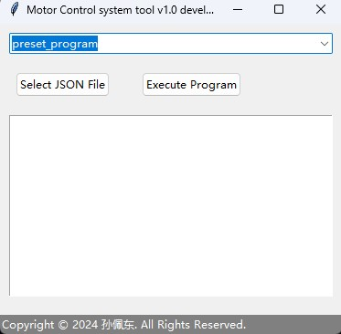

# Cable-pulling-robot-arm
A simple serial port cable-pulling robot arm control software based on Arduino and Python.🐍

## LICENSE

This project is licensed under the **Apache License 2.0**

See details in [LICENSE](LICENSE)

## README.md

zh_CN [简体中文](README.md)

en_US [English](README.en_US.md)

# Project Introduction

**This project is a cable-pulling stepper motor control system, including upper computer control code (ulcc) and lower computer control code (llcc).**

**[Cable-pulling-robot-arm Project GitHub Link](https://github.com/10032-bili/Cable-pulling-robot-arm/ "https://github.com/10032-bili/Cable-pulling-robot-arm/")**

## Repository Structure

### llcc Folder

- `llcc.ino`: Lower computer code (Arduino code in ino format)

### ulcc Folder

- `ulcc.py`: Upper computer code written in Python
- `ulcc.exe`: Executable file for Windows

### pic Folder

- Project-related images

### README

- Introduction document

### LICENSE

This project is licensed under the **Apache License 2.0**!

## Project Introduction

# Upper Code (ulcc)

The upper computer control code is implemented in Python to create a graphical user interface (GUI) for a motor control system using the tkinter library in Python.

The `motor_control` part allows users to communicate with the lower computer via serial port to perform basic control operations, such as rotating specific axes and sending custom serial commands.

The `preset_program` allows loading and executing preset JSON file motor motion programs.

The `program_editing` provides a simple text editor that allows users to input and edit motor motion commands, which can then be saved as JSON format files.

## Main Logic and Structure Analysis

Class Definition and Initialization:

A `MotorControlApp` class is defined to manage the GUI and logic related to motor control.

The constructor `__init__` initializes the GUI, including the title, mode selection, layout of different modes' interfaces (motor control, preset program, program editing), and handling of close events.

## GUI Layout and Interface Switching:

Different functional mode interfaces are created using the `create_motor_control_ui`, `create_preset_program_ui`, and `create_program_editing_ui` methods.

The `switch_mode` method is used to switch the displayed interface based on the user-selected mode.

## Serial Communication:

Functions for serial port scanning (`refresh_ports`), starting serial communication (`start_serial`), and listening to serial data (`listen_serial`) are provided.

The `send_serial` and `send_and_log` methods allow users to send custom commands to the serial port and display feedback in the text box.

## Motor Control:

Allows users to control motor rotation (clockwise and counterclockwise) through the GUI, select axes, set step values, and step speeds.

The `rotate_axis` method handles motor rotation logic (when an axis rotates, the corresponding positive cable-pulling motor rotates clockwise, and the negative cable-pulling motor rotates counterclockwise), including calculating rotation direction and speed.

## Preset Program Execution:

Allows users to load and execute preset motor motion programs stored in JSON files (`execute_program`).

The program sends organized serial commands to the serial port according to the `time` parameter in the JSON, in chronological order.

Executing preset programs asynchronously in a new thread avoids blocking the main thread of the GUI.

## Program Editing and Saving (program_editing module):

Provides a simple text editor and a slider-based visual JSON generation editor, allowing users to manually input JSON or edit motor motion commands via sliders, which can then be saved as JSON format executable files.

# Lower Code (llcc)

The lower computer control is based on Arduino, and the code's main function is to control the motion of up to 8 stepper motors by receiving commands via serial port. Each command includes motor number, rotation direction, rotation angle, and rotation speed.

The code parses the commands received via serial port, calculates the required steps and time intervals for each motor, and then controls the motor to rotate the specified angle in the specified direction and speed. Principle of operation:

## Formulas and Logic

1. **Step Calculation Formula**:
   - The rotation of the stepper motor is achieved by controlling the number of steps. Each step corresponds to a fixed angle, known as the step angle.
   - The required number of steps for a given rotation angle can be calculated by the following formula:

     

   - In the code, the step angle is assumed to be 1.8 degrees, which is a common value for many stepper motors.

2. **Speed Control Logic**:
   - The rotation speed of the motor is achieved by controlling the time interval between two consecutive steps. The shorter the time interval, the faster the motor rotates.
   - The rotation speed (degrees per second) can be converted to the time interval per step (microseconds) by the following formula:

     

   - Since the speed is given in degrees per second, it needs to be converted to the time interval per step. This interval defines the frequency of motor stepping.

3. **Command Parsing Logic**:
   - The code first waits for commands received via serial port (terminated by newline character `\n`), then parses each command.
   - Each command consists of motor number, direction ('+' for forward, '-' for backward), rotation angle, and speed, separated by ','.
   - After parsing the command, the code calculates the required steps and step intervals, and sets the direction of the corresponding motor.

4. **Motor Control Logic**:
   - For each motor, the code controls the STEP pin (pulse) to perform stepping action. Setting the STEP pin to HIGH and then to LOW rotates the motor by one step angle.
   - Control the time interval of each step to achieve speed control, ensuring that the motor rotates at the specified speed.
   - When the motor completes all the specified steps, the command for that motor is executed.

## Code Logic

- In the `setup()` function, initialize all motor pins as output mode and enable the motors.
- The `loop()` function continuously checks the serial port, parses the received commands, and controls motor movement according to the commands.
- For each command, calculate the steps and step intervals for each motor based on the given angle and speed.
- Use the `micros()` function and the calculated step interval to control motor stepping for smooth and precise speed control.
- When the motor reaches the desired number of steps, stop stepping for that motor.

**In this way, the lower computer code effectively converts commands received from the serial port of the upper computer into physical movements of the motors, achieving precise control of the stepper motors**👍
