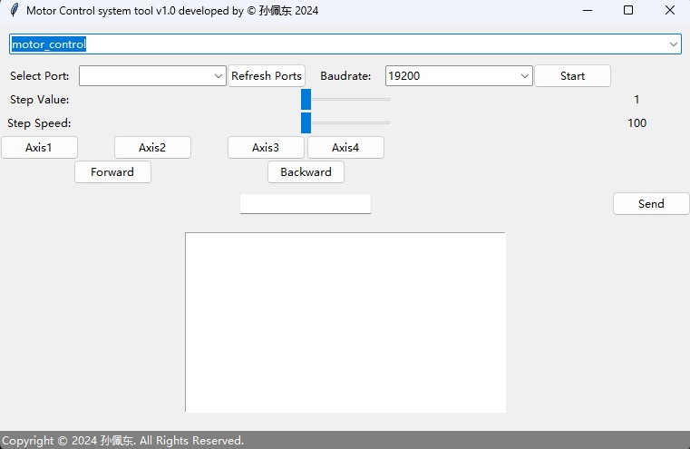
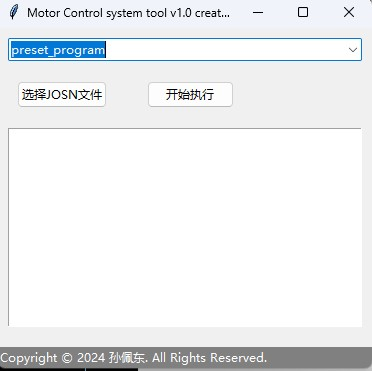
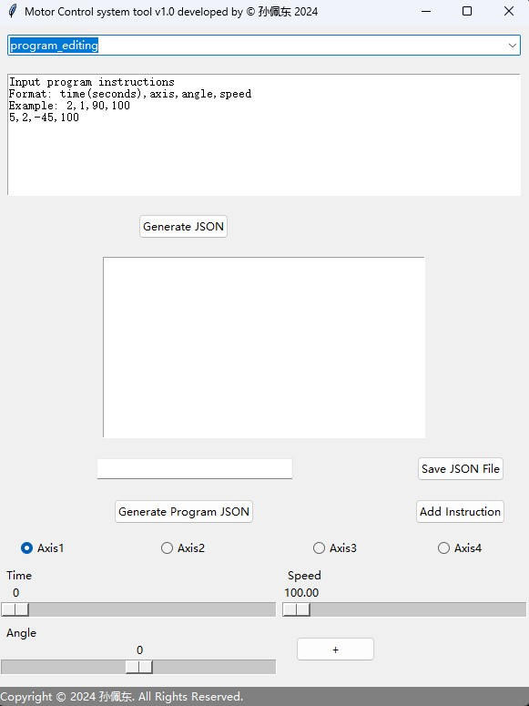

# 项目介绍

**本项目是一种拉线步进电机控制系统，包含上位机控制代码（ulcc）和下位机控制代码（dlcc）。**

**[Cable-pulling-robot-arm项目Github链接](https://github.com/10032-bili/Cable-pulling-robot-arm/ "https://github.com/10032-bili/Cable-pulling-robot-arm/")**
## 项目介绍

# 上位代码（ulcc）
  上位机控制代码由python实现了一个电机控制系统的图形用户界面（GUI），通过 tkinter 库在Python中构建。
  
  `motor_control`部分允许用户通过串口与下位机进行通信，执行基本的控制操作，比如旋转特定的轴，发送自定义的串口指令。
  

  `preset_program`允许加载和执行预设的json文件电机运动程序。
  

  `program_editing`提供了一个简单的文本编辑器，允许用户输入和编辑电机运动指令，然后将其保存为JSON格式的文件。  
  

## 主要逻辑与结构解析
类定义和初始化:  

定义了一个 `MotorControlApp` 类来管理GUI和与电机控制相关的逻辑。

构造函数 `__init__ `初始化GUI，包括标题、模式选择、不同模式下的界面布局（电机控制、预设程序、程序编辑）以及关闭事件的处理。  

## GUI布局和界面切换:

  通过 create_motor_control_ui, create_preset_program_ui, 和 create_program_editing_ui 方法创建不同功能模式的界面。  

使用`switch_mode`方法来根据用户选择的模式切换显示的界面。  

## 串口通信:

提供了串口扫描（refresh_ports）、启动串口通信（start_serial）和监听串口数据（listen_serial）的功能。  

通过 `send_serial` 和 `send_and_log` 方法允许用户发送自定义命令到串口，并在文本框中显示反馈。
## 电机控制:

允许用户通过GUI控制电机旋转（正转和反转），选择轴，设置步进值和步进速度。  

使用 `rotate_axis` 方法来处理电机旋转逻辑（当轴旋转，对应的正向拉线电机正转，反向拉线电机反转。），包括计算旋转方向和速度。  

## 预设程序执行:  

允许用户加载和执行存储在JSON文件中的预设电机运动程序（execute_program）。  

通过在新线程中异步执行预设程序，避免阻塞GUI的主线程。  

## 程序编辑和保存(program_editing模块):

提供了一个简单的文本编辑器，允许用户输入和编辑电机运动指令，然后将其保存为JSON格式的文件。

# 下位代码（llcc）

  下位机控制基于arduino，代码的主要功能是通过串口接收命令来控制最多8个步进电机的运动。每个命令包括电机编号、旋转方向、旋转角度以及旋转速度。
  
  代码通过解析串口接收到的命令，计算每个电机所需的步数和每步的时间间隔，然后控制电机按照指定的方向和速度旋转指定的角度。运行原理：

## 公式和逻辑

1. **步数计算公式**:
   - 步进电机的旋转是通过控制步数来实现的。每一步对应一个固定的角度，称为步距角。
   - 对于一个给定的旋转角度，所需的步数可以通过下面的公式计算：
     $$
     \text{所需步数} = \frac{\text{旋转角度}}{\text{步距角}}
     $$
   - 在代码中，步距角被假定为1.8度，这是很多步进电机的一个常见值。

2. **速度控制逻辑**:
   - 电机的旋转速度通过控制两个连续步进之间的时间间隔来实现。时间间隔越短，电机旋转的速度越快。
   - 旋转速度（度/秒）可以转换为每步的时间间隔（微秒）：
     $$
     \text{每步时间间隔（微秒）} = \frac{1,000,000}{\text{速度（度/秒）}} \times \text{步距角}
     $$
   - 由于速度是以度/秒为单位给出的，因此需要将其转换为每步的时间间隔。这个间隔定义了电机步进的频率。

3. **命令解析逻辑**:
   - 代码首先等待串口接收到命令（以换行符`\n`结束），然后逐个解析命令。
   - 每个命令由电机编号、方向（'+'表示正向，'-'表示反向）、旋转角度和速度组成，各部分通过','分隔。
   - 解析命令后，代码会计算所需步数和每步的时间间隔，并设置相应电机的方向。

4. **电机控制逻辑**:
   - 对于每个电机，代码通过控制STEP引脚（脉冲）来执行步进动作。每次将STEP引脚设置为HIGH然后设置为LOW，电机转动一个步距角。
   - 控制每步的时间间隔来实现速度控制，确保电机以预定的速度旋转。
   - 当电机完成所有预定的步数后，该电机的命令执行完毕。

## 代码逻辑

- 在`setup()`函数中，初始化所有电机的引脚为输出模式，并将电机使能。
- `loop()`函数不断检查串口，解析接收到的命令，并根据命令控制电机运动。
- 对于每个命令，根据给定的角度和速度，计算每个电机的步数和步进间隔。
- 使用`micros()`函数和计算出的步进间隔控制电机步进，以实现平滑且精确的速度控制。
- 当电机达到所需步数时，停止该电机的步进。

**通过这种方式，下位机代码有效地将串口接收到的上位机命令转换为电机的物理运动，实现了对步进电机精确控制的目的**
